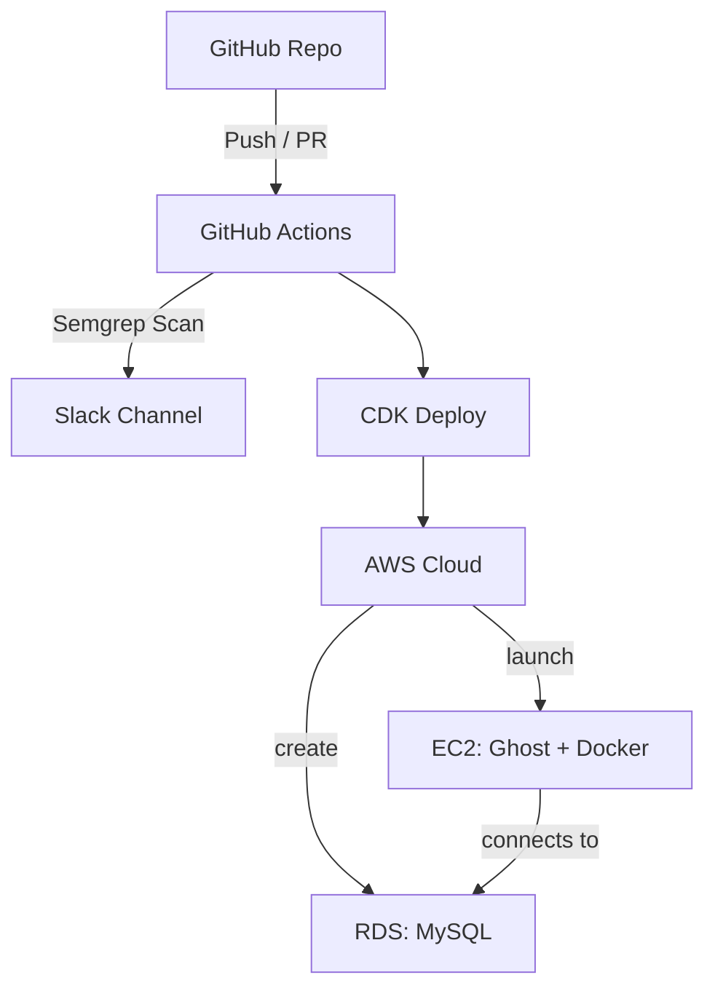

#  Ghost CMS DevSecOps Deployment

This project automates the secure deployment of [Ghost CMS](https://ghost.org/) using AWS CDK, Docker, and a DevSecOps pipeline that includes Semgrep static code analysis and Slack notifications.

---

## Infrastructure Overview

| Component          | Description                    |
| ------------------ | ------------------------------ |
| **EC2**            | Runs Ghost CMS in Docker       |
| **RDS (MySQL)**    | (Optional) External DB support |
| **CDK (Python)**   | Infrastructure as Code         |
| **GitHub Actions** | CI pipeline with Semgrep scan  |
| **Slack**          | Receives scan alerts           |

---

##  Architecture Diagram



---

##  How to Deploy

```bash
cdk bootstrap
cdk deploy
```

After deployment:

* Ghost CMS: `http://<EC2_PUBLIC_IP>:2368`
* Admin Setup: `http://<EC2_PUBLIC_IP>:2368/ghost`

---

##  Security Features

*  Limited security group access (SSH and app ports only)
*  Semgrep scan on PR/push to `main`
*  Slack integration for fast alerting
*  SSH with key pair (no password auth)
*  CDK-managed infrastructure teardown (`cdk destroy`)

---

##  CI/CD – Semgrep + Slack

* **Workflow**: `.github/workflows/semgrep-slack.yml`
* **Trigger**: Every push / PR to `main`
* **Slack Webhook**: Configured via GitHub secrets

---

##  Project Structure

```bash
ghost-cdk/
├── ghost_cdk/
│   ├── ghost_cdk_stack.py       # CDK Stack: EC2, RDS
│
├── app.py                       # CDK App entry
├── .github/workflows/           # GitHub Actions
│   └── semgrep-slack.yml
├── README.md
└── requirements.txt
```

---

##  Testing

*  Access Ghost CMS in browser
*  Add a test Semgrep rule (e.g., `eval("bad")`) and push
*  Slack receives alert
*  Check GitHub Actions log
*  check : http://16.16.25.243:2368/

---

##  Cleanup

To avoid AWS charges:

```bash
cdk destroy
```

---

##  Notes

* Node 18 is deprecated — use Node 20+ for long-term support
* Amazon Linux 2 support ends in 2026 — consider Amazon Linux 2023
* For production: use Docker volumes and secure DB credentials (Secrets Manager)

---

##  Contact

**Author**: Hussein Souheill
**GitHub**: [github.com/HSouheill](https://github.com/HSouheill)
